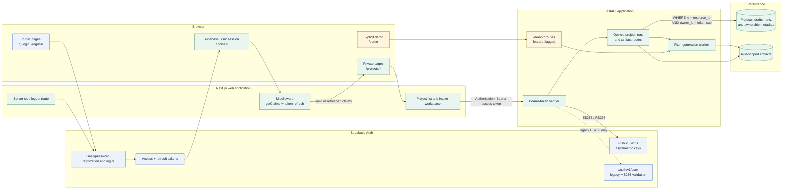
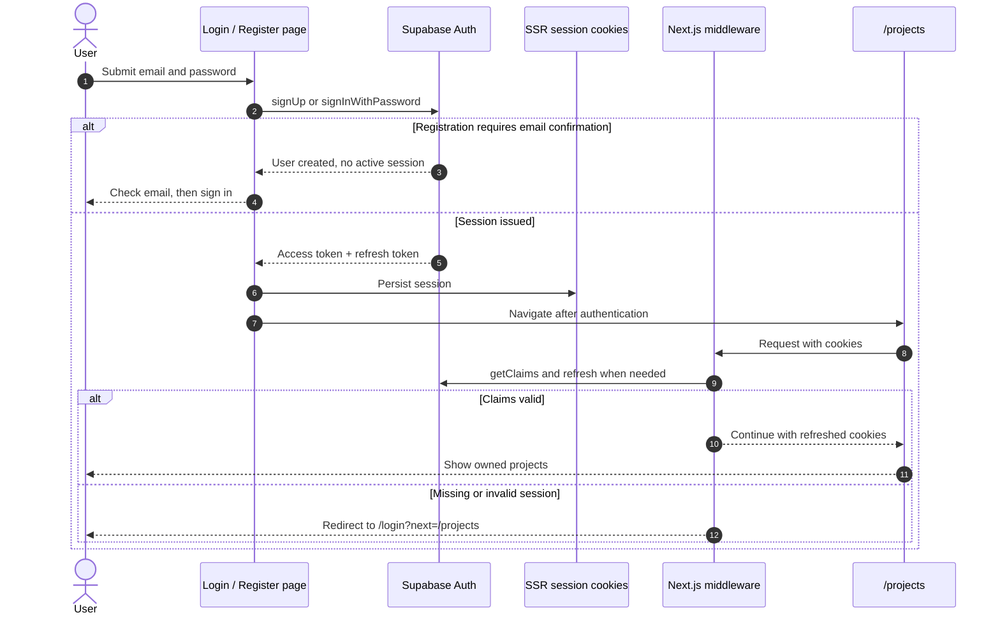
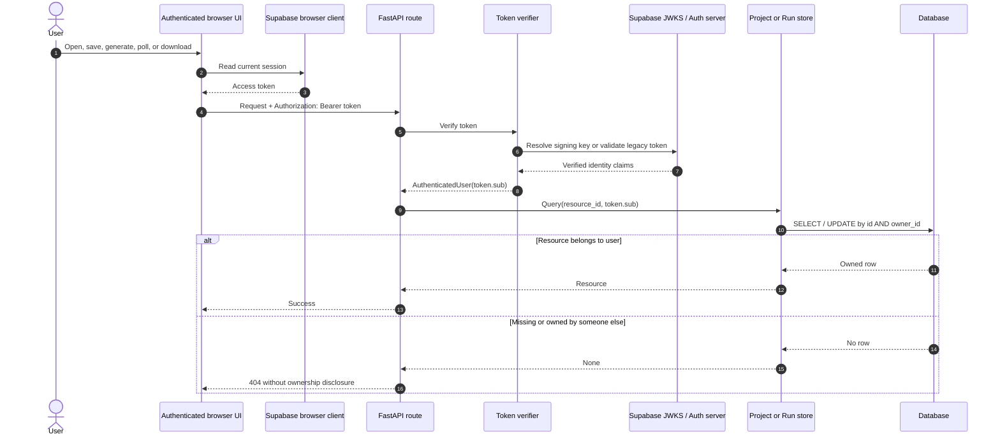
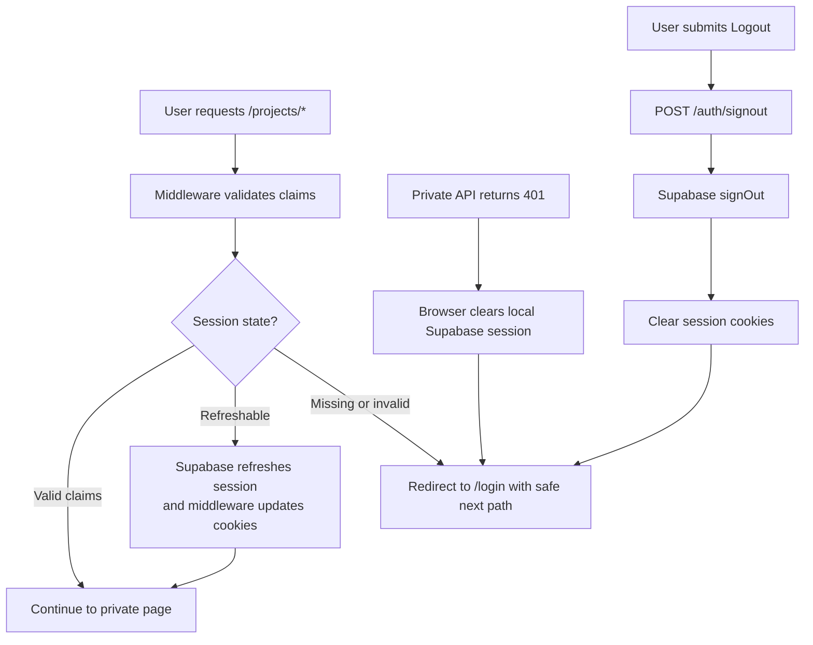
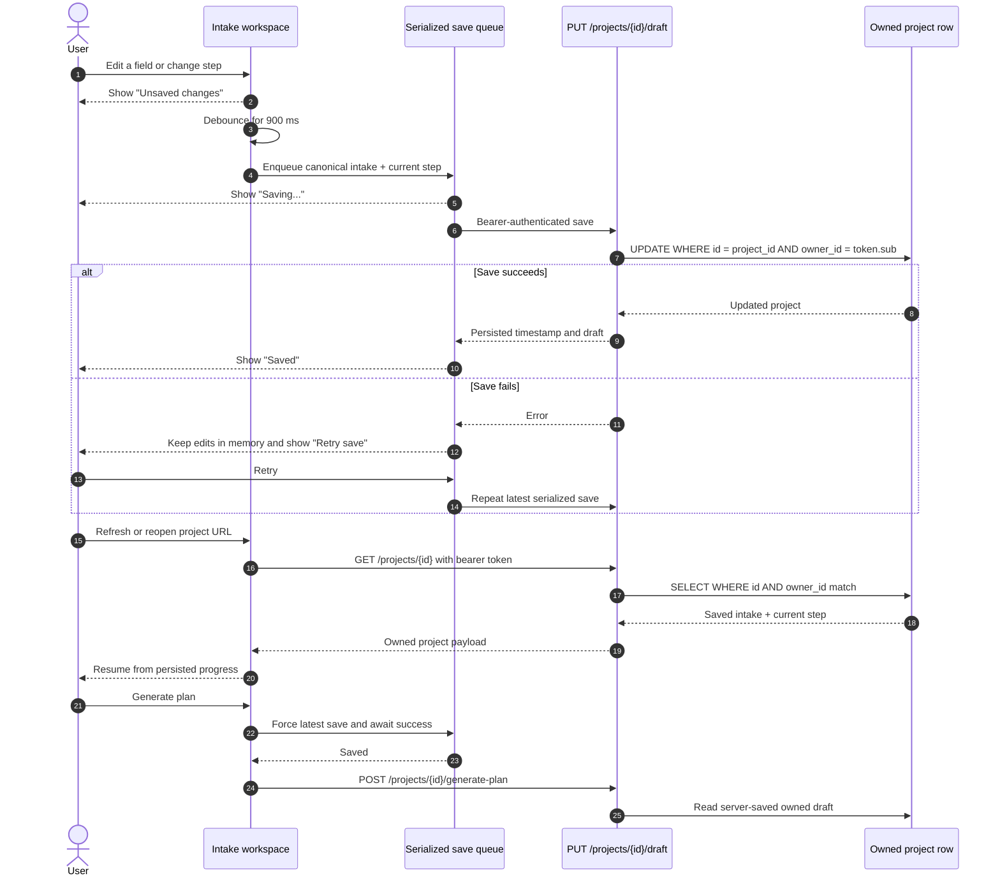

# Private Beta Authentication and Save/Resume

## System architecture



The two enforcement layers have different jobs: Next.js middleware protects navigation and
refreshes cookies, while FastAPI independently verifies every bearer token and enforces database
ownership. Bypassing the browser guard therefore does not grant access to private data.

## Registration, login, and session workflow



## Authenticated API and ownership workflow



The browser never supplies a trusted user ID. It receives only a Supabase publishable key; the
API does not use or require a service-role credential. Asymmetric Supabase JWTs are verified
against the project's JWKS. Legacy HS256 tokens are validated by Supabase Auth's `/user`
endpoint with the publishable key, not with a shared JWT signing secret.

## Expired-session and logout workflow



## Compact auth flow map

```text
Register / Login
  -> Supabase Auth issues access + refresh tokens
  -> @supabase/ssr stores the session in cookies
  -> Next.js middleware validates/refreshes claims for /projects/*
  -> browser sends the access token as Authorization: Bearer to FastAPI
  -> FastAPI verifies issuer, audience, expiry, signature, and token subject
  -> database queries use that verified subject as owner_id

Logout
  -> server route signs out with Supabase
  -> session cookies are cleared
  -> user returns to /login
```

## Protected-route map

| Route | Protection | Ownership behavior |
|---|---|---|
| `/projects` and `/projects/[projectId]` | Next.js middleware | Redirects missing/expired browser sessions to login |
| `POST/GET /projects` | FastAPI bearer token | Creates/lists records for verified token subject only |
| `GET /projects/{id}` | FastAPI bearer token | Queries by project ID and verified owner ID; otherwise 404 |
| `PUT /projects/{id}/draft` | FastAPI bearer token | Updates by project ID and verified owner ID; ignores extra client fields |
| `POST /projects/{id}/generate-plan` | FastAPI bearer token | Generates from the owned server-saved draft |
| `GET /runs/{id}` | FastAPI bearer token | Queries by run ID and verified owner ID |
| `GET /runs/{id}/artifacts/{filename}` | FastAPI bearer token | Requires the run owner and an indexed artifact filename |
| `/demo` and `/demo/*` | Explicit demo flag | Separate ownerless fixture flow; API disabled unless `ENABLE_DEMO_MODE=true` |

## Saved-draft behavior



- A new project is created before the intake opens.
- Field and step changes are debounced for 900 ms, then canonicalized and saved to the project's
  `intake_json` and `current_step` fields.
- The UI shows `Unsaved changes`, `Saving…`, `Saved`, or `Save failed`.
- Failed saves retain the in-memory edits, warn against leaving/refreshing, and expose a retry.
- Generation forces a successful save first, then the API generates from the database copy.
- Opening a saved project or refreshing its URL reloads the persisted intake and step.
- The projects screen lists drafts by most recently saved and links directly to resume them.

## Deployment notes and residual risks

- Apply `alembic upgrade head` before starting the API.
- Configure matching Supabase URL/publishable keys for API and web. Configure Supabase redirect
  URLs and email-confirmation behavior for the deployed origin.
- Keep `ENABLE_DEMO_MODE=false` unless a public demo is intended. When enabled, demo generation
  needs deployment-level rate limiting/cost controls because it intentionally has no login.
- Local-disk artifacts and in-process background jobs remain single-host beta constraints. Moving
  to multiple API hosts requires shared object storage and a durable queue.
- There is no server-side token revocation lookup for asymmetric JWTs between issuance and their
  short expiry. Supabase session expiry settings bound that window; legacy HS256 validation does
  perform an Auth-server lookup.
- Autosave uses last-write-wins. Concurrent editing of the same project in multiple tabs/devices
  can overwrite a newer draft; optimistic version checks are deferred beyond the minimum beta.
